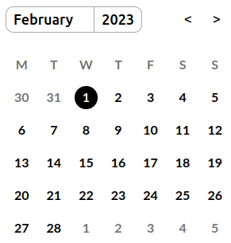

# React Calendar
</img>
This is a simple React Calendar component that displays a monthly calendar and allows users to interact with the calendar by clicking on a date.

## Features
- Displays a calendar for the current month
- Allows users to change the current month and year
- Emits an event when a date is clicked

## Usage
Here is an example of how to use the Calendar component in your React application:

```javascript
import React from 'react';
import ReactDOM from 'react-dom/client';
import Calendar from './Calendar';

const root = ReactDOM.createRoot(document.getElementById('root'));
root.render(
  <React.StrictMode>
    <Calendar 
      date={new Date(2023, 1, 1)}
      onDateClick={e => console.log("Clicked:", e)}
    />
  </React.StrictMode>
);
```
In the example above, we are importing the Calendar component from the Calendar.js file and rendering it inside a React DOM element with an id of root. The Calendar component accepts several props that allow you to customize its behavior:

## Props
- **`displayedMonth`**:  
This prop allows you to specify which month should be displayed on the calendar. The value should be a number between 0 (for January) and 11 (for December). If this prop is not specified, the current month will be displayed.

- **`displayedYear`**:  
This prop allows you to specify which year should be displayed on the calendar. The value should be a 4-digit number representing the year. If this prop is not specified, the current year will be displayed.

- **`date`**:  
This prop allows you to specify which date should be selected on the calendar. The value should be a Date object. If this prop is not specified, the current date will be selected.

- **`onDateClick`**:  
This prop allows you to specify a function that will be called whenever a date is clicked on the calendar. The function will be passed the Date object representing the selected date. If this prop is not specified, clicking on a date will not do anything.

## Examples
Here are some examples of how you can use the Calendar component in your React application:

```js
<Calendar />
```
This will render a calendar for the current month and year, with the current date selected. Clicking on a date will not do anything.

```js
<Calendar 
  displayedMonth={6} 
  displayedYear={2022} 
  date={new Date(2022, 6, 15)} 
  onDateClick={e => console.log("Clicked:", e)} 
/>
```
This will render a calendar for July 2022, with the 15th of July selected. When a date is clicked, the selected Date object will be logged to the console.

## Contributing
This project is open for contributions. If you have any suggestions or ideas, feel free to open an issue or submit a pull request.

## License
This project is licensed under the MIT license.